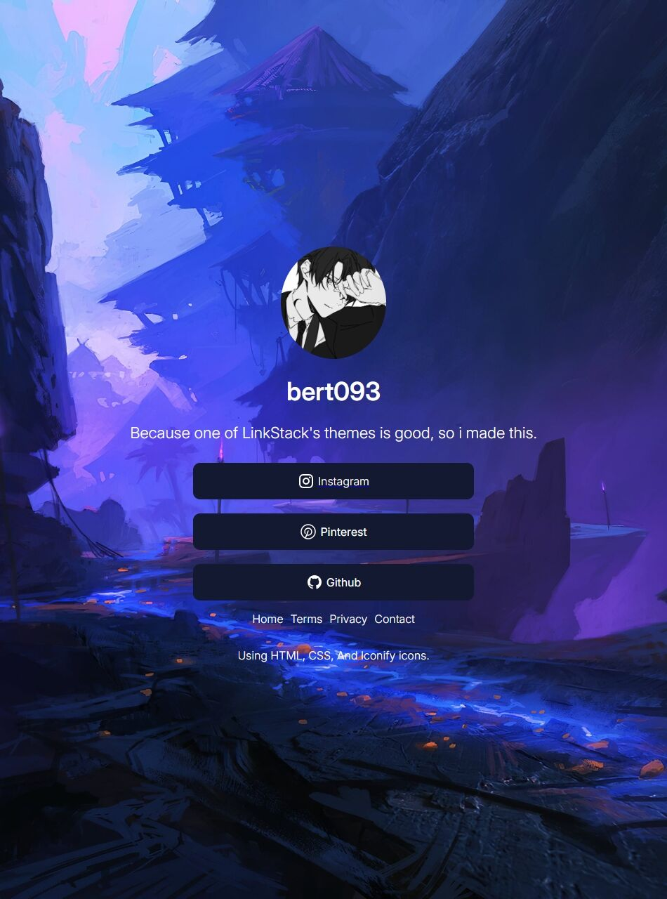

# 🌐 Simple Link Profile Page

A minimalist and responsive **profile link page** inspired by platforms like Linktree and Linkstack — built with just **HTML**, **CSS**, and **[Iconify](https://iconify.design/)** for crisp, scalable SVG icons. No frameworks, no JavaScript (unless needed for enhancements).

## ✨ Features

- ⚡ Fast and lightweight — no JS required
- 📱 Fully responsive across devices
- 🎨 Clean, modern UI design
- 🧩 Powered by Iconify for SVG icons
- 💡 Easy to customize for personal branding or portfolios

## 📸 Website Preview

### 🖥️ Full HD – 1920x1080


### 💻 Laptop – 1366x768


### 📲 Touchscreen / Tablet Mode – 950x1280


## 📁 Project Structure
```
ProfilePageLink
├─ img
│  ├─ img.webp
│  └─ Kingdom.jpeg
├─ index.html
├─ style.css
├─ script.js
├─ README.md
├─ Desktop 1080p-1920x1080.jpg
├─ laptop default-1366x768.jpg
└─ tablet-950x1280.jpg
```